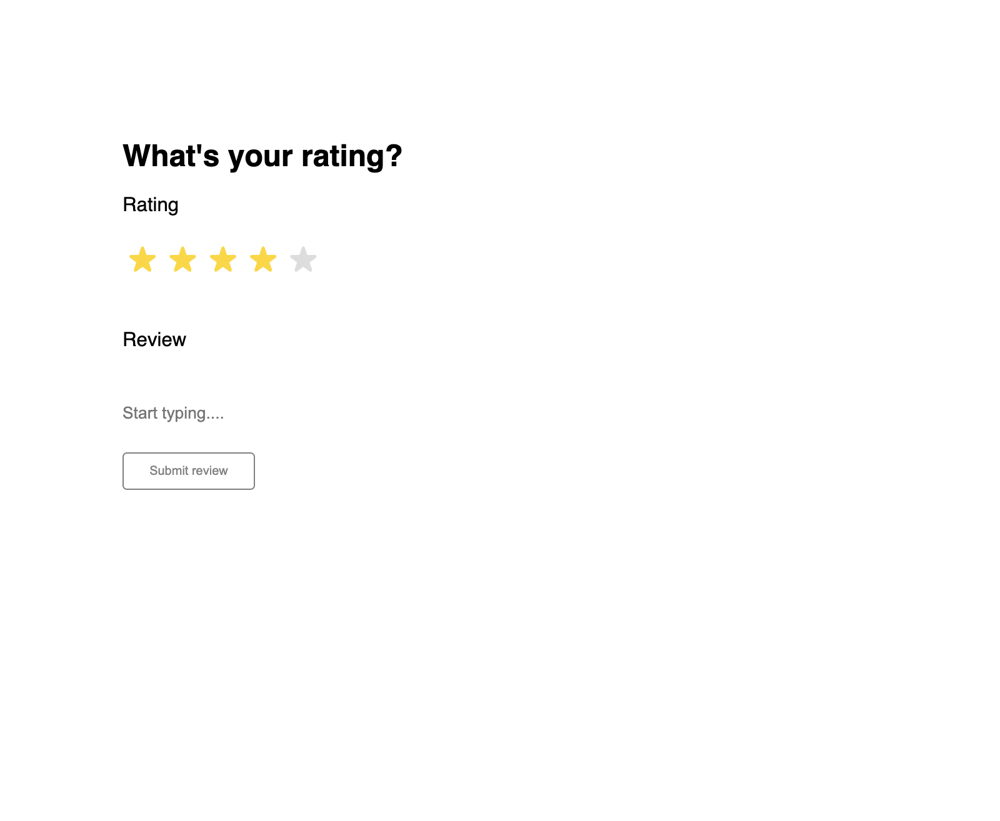
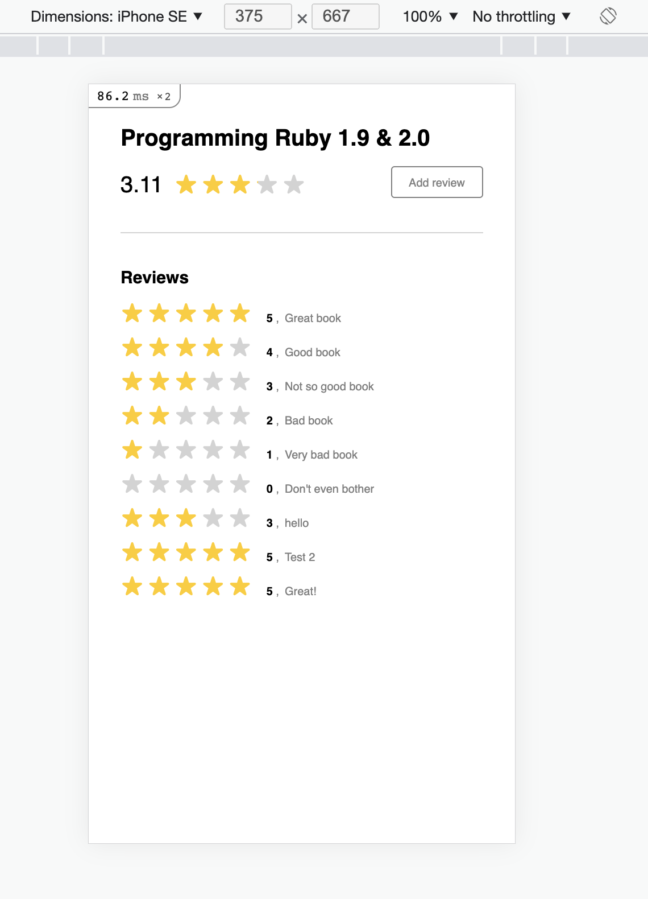
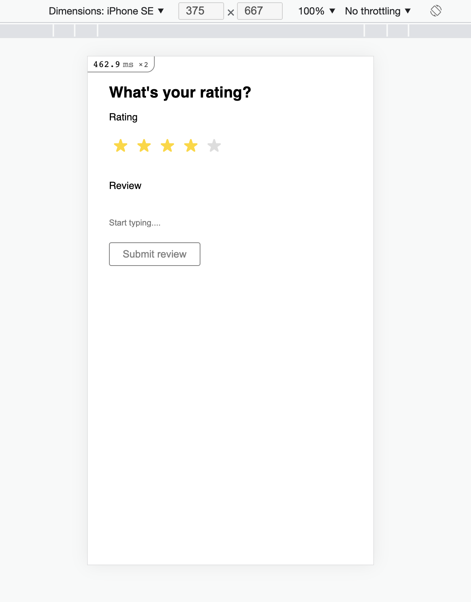

# README

## Setup
1. `bundle install`
2. `rails db:create`
3. `rails db:migrate`
4. `rails db:seed`

## Start
1. `rails s`
2. Visit http://localhost:3000

## Features
- Mobile-responsiveness
- 20 [backend] specs

## Screenshots
__Desktop:__

 

 

__Mobile:__

 

## Associations
- A product has many reviews
- A review belongs to a product

## Things to possibly do
- Nest API routes under versioned API (for backwards compatability)
- Write more tests (unit, integration, and frontend)

