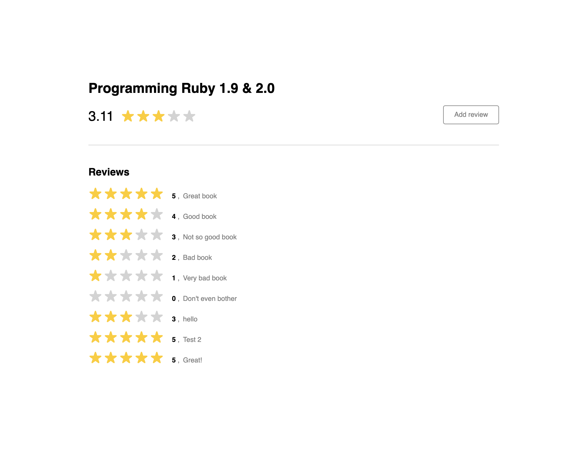

# _
Just a demo app for testing some things

## Setup
1. `bundle install`
2. `rails db:create`
3. `rails db:migrate`
4. `rails db:seed`

## Test
```
rails test
```

## Start
1. `rails s`
2. Visit http://localhost:3000

## Features
- Mobile-responsiveness
- 20 [backend] specs

## Screenshots
__Desktop:__


<br/>

<br/>

__Mobile:__


<br/>


## Associations
- A product has many reviews
- A review belongs to a product

## Architectural decisions
Nothing major. But here are some:
- Used Rails for the backend
  - To match the company's stack
  - And also since I'm most familiar with Rails
- Chose to use Rails' Minitests instead of RSpec
  - Minitests seemed sufficent for the level of complexity that I wanted to test,
    so I went with using it

## Things to possibly do
- Nest API routes under versioned API (for backwards compatability)
- Make API OpenAPI 3 compliant, and have some UI (using something like [the rswag gem](https://github.com/rswag/rswag) or [readme.io](https://readme.io/))
  - This would make it easier for frontend developers to interact with the backend, and know the available endpoints, and example objects that each endpoint might return
- Write more tests (unit, integration, and frontend)
